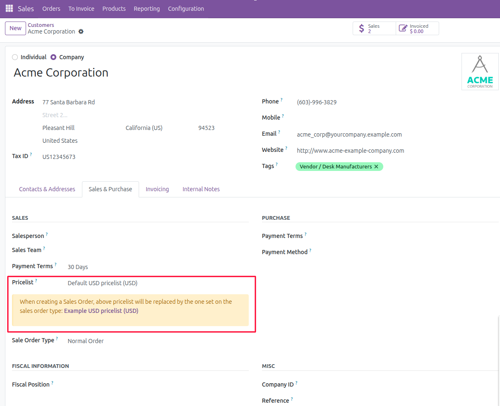

This module adds a typology for the sales orders. In each different
type, you can define, invoicing and refunding journal, a warehouse, a
stock route, a sequence, the shipping policy, the invoicing policy, a
payment term, a pricelist and an incoterm.

You can see sale types as lines of business.

You are able to select a sales order type by partner so that when you
add a partner to a sales order it will get the related info to it.

Additionally, it adds a warning message to notify users when there is a mismatch between the partner's default pricelist
and the effective pricelist set by the sales order type. The warning text adapts to the type's configured precedence mode
(see below) so that the user knows which value will actually be applied on new sales orders.
The warning is only visible for companies without a parent and when there is a mismatch between the two pricelists.

### Precedence modes (per sale.order.type)

Each `sale.order.type` declares how its propagated fields interact with the partner's defaults. The setting is exposed
in developer mode on the type form (Sales > Configuration > Sales Order Types > *type* > Precedence) and applies
uniformly to the pricelist, payment term, warehouse, shipping policy, incoterm, route and invoice journal.

- **Sale type wins** (`type_first`, default): the type's value overrides whatever the partner derives. This is the
  legacy behavior that has existed in this module since it was first published.
- **Partner wins; type fills gaps** (`partner_first`): the partner's value is used; the type's value only applies
  when the partner has no value for that field. Use this for customers who maintain authoritative partner-level
  defaults and treat sale order types primarily as labeling / reporting / sequence-numbering devices.
- **Ignore type for propagation** (`partner_only`): the type's pricelist / payment term / warehouse etc. are never
  pushed onto the sales order. The type record remains useful for grouping, filtering, sequences and the per-type
  invoice journal logic, but its other fields are decorative. Use this when you want a sale order type purely as a
  reporting axis.

A company-wide default is configurable in *Settings → Sales* and is applied when new types are created. Changing the
default does not modify existing types; their precedence is preserved.

Manual edits on a sale order are preserved across recomputes by trigger
narrowing: once a user sets the pricelist (or payment term, etc.)
directly on a SO, the value will not be overwritten unless `type_id` or
`partner_id` actually changes. A `type_id` change *does* re-fire the
type's value in `type_first` mode — this is the documented legacy
behavior and matches user expectations for an explicit type change.

For stricter dirty-state preservation (preserve user edits even on a
type change, with a Salesforce/SAP-style badge to surface "this value
is anchored by the user"), install the companion module
`web_field_provenance` when it's available
(see Huly OCA-23 / ledoent initiative). This module's
`record._user_set(fname)` API is consulted automatically by
`sale.order._sot_resolve` — when installed and the user has manually
set a field, the precedence rules are bypassed and the manual value
wins regardless of mode. The integration is a soft dependency: this
module works standalone and behaves identically when
`web_field_provenance` is not installed.
